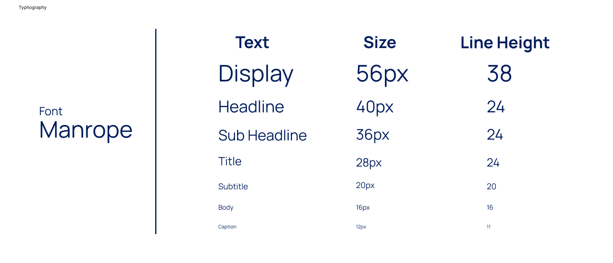
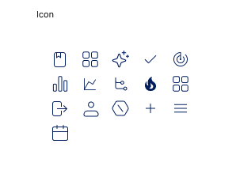
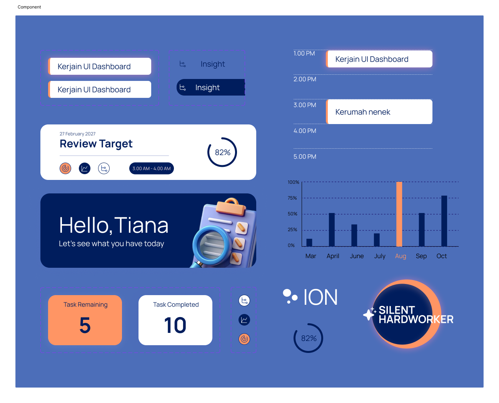

# Dashboard-ION-Productivity

  
  

ION Dashboard is a task management dashboard designed to help users organize and track their daily tasks efficiently.  It features task statistics, a structured to-do list, progress tracking, timeline overview, and a badge system to encourage consistency. 

This desktop-based task management interface designed to reduce information overload and improve decision clarity.  
This project focuses on organizing tasks visually based on priority, urgency, and workload capacity.

Features
- Priority & urgency categorization
- Task overview dashboard
- Timeline visualization
- Clean and structured UI layout
- Capacity-based task organization concept

## Design System
This dashboard was designed to solve common problems in task overload.  
The interface emphasizes clarity, structure, and smart grouping to help users focus on what truly matters.

## 1.Typography
The dashboard uses **Manrope** as its primary typeface. Manrope was chosen for its modern, minimal, and highly readable character, supporting a clean and structured interface.

## 2.Colour Palletes
The dashboard uses a **Blue and Orange** color palette to create a balance between clarity and energy.

- **Blue** represents structure, focus, and trust. It dominates the interface background and primary components, creating a calm and professional atmosphere.
- **Orange** is used as an accent color to highlight important actions, priorities, and interactive elements. It adds contrast and visual energy without overwhelming the layout.

## 3. Icon 
The dashboard uses thin and minimalist icons to maintain a clean and modern visual language.

This approach prevents visual clutter and keeps the interface lightweight, especially in data-heavy sections. The minimalist style supports clarity and ensures that icons enhance usability without overpowering the content.

## Components
The dashboard is built using modular and reusable UI components to ensure consistency and scalability.

Each component is designed withconsistent typography, and structured alignment. The layout follows a grid-based system to maintain visual balance and improve readability.

## External Links

- 🎨 Behance Project: [your-link](https://www.behance.net/gallery/245082131/Dashboard-ION-Productivity-App)
- 📂 Google Drive): [https://drive.google.com/your-link](https://drive.google.com/drive/folders/1ExS7_JAvLfs3MWyy_E8b6r40An3pMV_K?usp=drive_link)

(Figma File is in the Google Drive)
